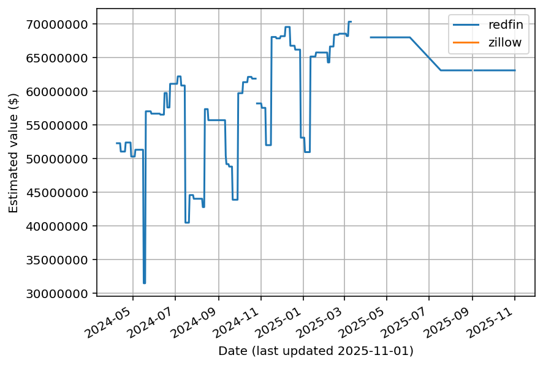

# real-estate-scrape example

A repository demonstrating the use of
[real-estate-scrape](https://github.com/mikepqr/real-estate-scrape) to store the
estimated value of a property on Redfin and Zillow every night using Github
Actions.

See [`data.csv`](data.csv) and [`data.png`](data.png) (above) for example output
for [594 S Mapleton Dr, Los
Angeles](https://www.redfin.com/CA/Los-Angeles/594-S-Mapleton-Dr-90024/home/6824711)
(not my house!)

## Automated usage

1. Sign up for [scraperapi](https://www.scraperapi.com/) and make a note of your
   API key. The free account is enough to get started.

2. Make a copy of this repository, e.g. [using the
   template](https://github.com/mikepqr/real-estate-scrape/generate).

3. Commit changes deleting `data.csv` and `data.png`.

4. Under Settings > Secrets, configure environment variables containing the URLs
   of the address on Redfin and Zillow and your ScraperBox key:
    - `REDFIN_URL`, e.g.
      `https://www.redfin.com/CA/Los-Angeles/594-S-Mapleton-Dr-90024/home/6824711`
    - `ZILLOW_URL`, e.g.
      `https://www.zillow.com/homedetails/594-S-Mapleton-Dr-Los-Angeles-CA-90024/20524417_zpid/`
    - `SCRAPERAPI_KEY`, e.g.`abcdefqwert12345`

The scraping job runs every day at 5am UTC. Come back in 24 hours and you should
find `data.csv` in your repository. Come back a few days later and you should
see the beginnings of a chart in `data.png`.

Alternatively, you can run the scraping job manually as often as you like by
clicking "Run workflow" under Actions > scrape on GitHub.

## Advanced/manual usage

See [real-estate-scrape](https://github.com/mikepqr/real-estate-scrape).
